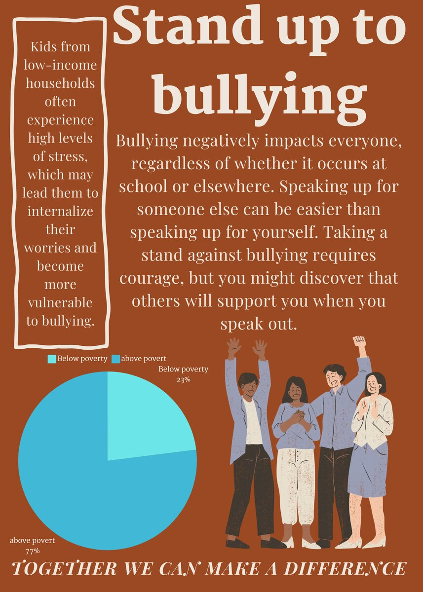
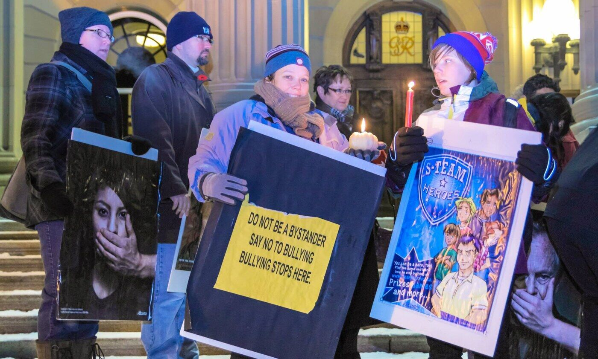

## As 13 razões do BullyingAs 13 razões do Bullying

O bullying é uma ação cada dia mais comum no meio escolar, porém, o que a grande maioria não se 
dá conta, é que ela pode ter consequências graves em todas as instâncias da vida da pessoa. 
Recentemente, a Netflix lançou uma série que trata sobre o tema: 13 reasons why. A grande 
discussão entorno da série é a prática do bullying no meio escolar, os danos que ele pode causar 
e o papel da sociedade e escola no combate e conscientização do ato.Hanna Beker é uma adolescente 
recém-chegada em uma pequena escola no interior, que sofre as mais variadas ações e agressões por 
parte dos novos colegas. Sem a ajuda e acompanhamento adequado, ela toma uma decisão extrema: o 
suicídio. Para alguns, pode até parecer exagero, mas o fato é que esses casos vêm se tornando 
mais e mais comuns entre crianças e adolescentes.

Na série em questão, a escola nega conhecimento dos casos de bullying e essa é uma consequência 
grave. Mas afinal, qual o papel da escola nesse caso? Como nós educadores podemos prevenir e 
conscientizar pais e alunos sobre tal ação?
Nosso papel é entender esse conceito e lutar para o combate de sua progressão no meio escolar. 
Como mestre e pesquisadora da Educação, é possível compreender que a escola precisa trabalhar e 
se desenvolver para que a tomada de consciência aconteça de modo geral, desde a equipe 
pedagógica, o administrativo até os discentes. Devemos sim estar sempre atentos para detectar o 
processo e trabalhar em prol dos alunos vitimizados pelo bullying. Fechar os olhos para o que 
acontece em nosso dia a dia é um erro, devemos prestar atenção e ao menor sinal de bullying, 
tomar as devidas providências. Só essa mobilização pode diminuir tal sofrimento. Cabe ao núcleo 
escolar deixar esses alunos amparados e mais à vontade no meio. Da mesma maneira, a prevenção e 
tratamento devem ser multidisciplinar e incluir vários profissionais.
É de extrema importância a intervenção na família e na escola, com planos que possam melhorar a 
vida daquela criança ou adolescente. Na grande maioria das vezes, como no caso de Hanna na série, 
sabemos que esses jovens não terão atendimento adequado, e, em alguns casos, nem o reconhecimento 
da situação. Diante disso, a principal forma de lutar para evitar o bullying, é investir em 
prevenção e estimular a discussão aberta com todos os atores da cena escolar, incluindo pais e 
alunos. Orientar os pais para que possam ajudar, pois os mesmos devem estar sempre alertas para o 
problema, seja o filho vítima ou agressor, ambos precisam de ajuda e apoio psicológico. Em muitos 
casos é esquecida a prática de cuidar do agressor, este também pede socorro.
O bullying é um problema sério, que pode levar a graves consequências e precisa ser extinto. Em 
meio a era digital e a tantas mudanças sociais e culturais, nós, como pais e educadores devemos 
estar ainda mais atentos para o que está acontecendo. E a reversão desses casos só será possível 
com o apoio da escola, pais e próprios alunos.
* Ana Regina Caminha Braga (anaregina_braga@hotmail.com) é escritora, psicopedagoga e 
especialista em educação especial e em gestão escolar.