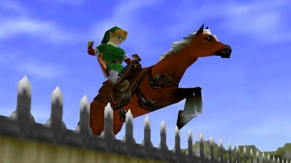
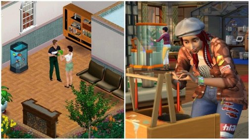
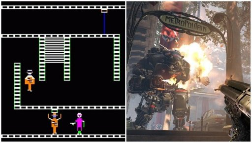
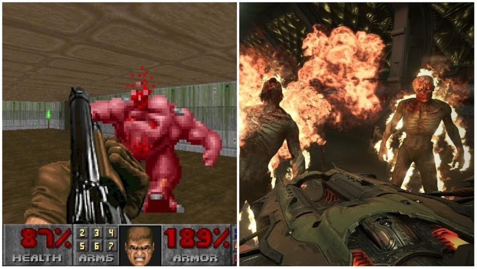
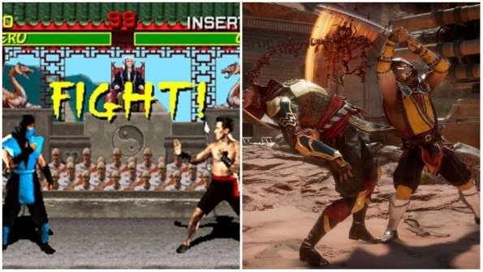
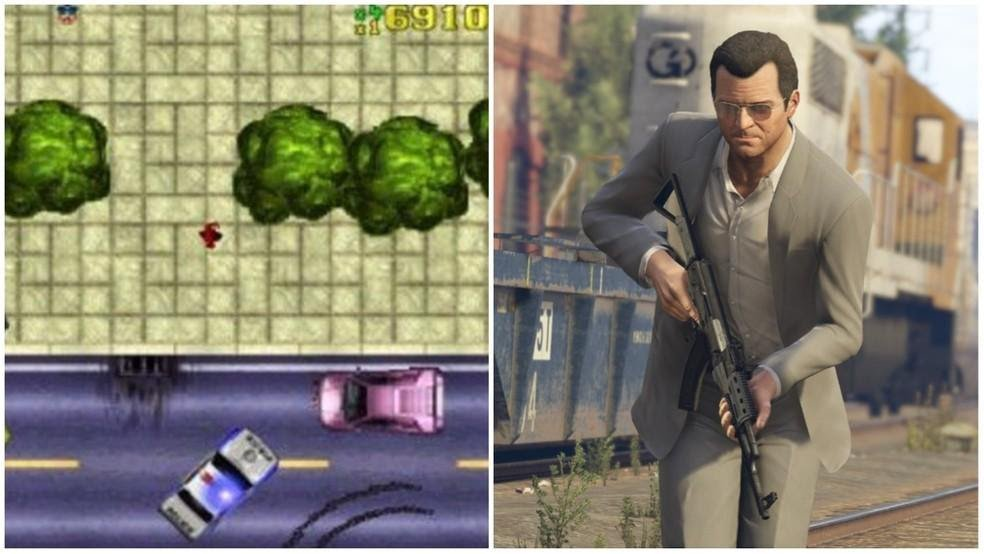
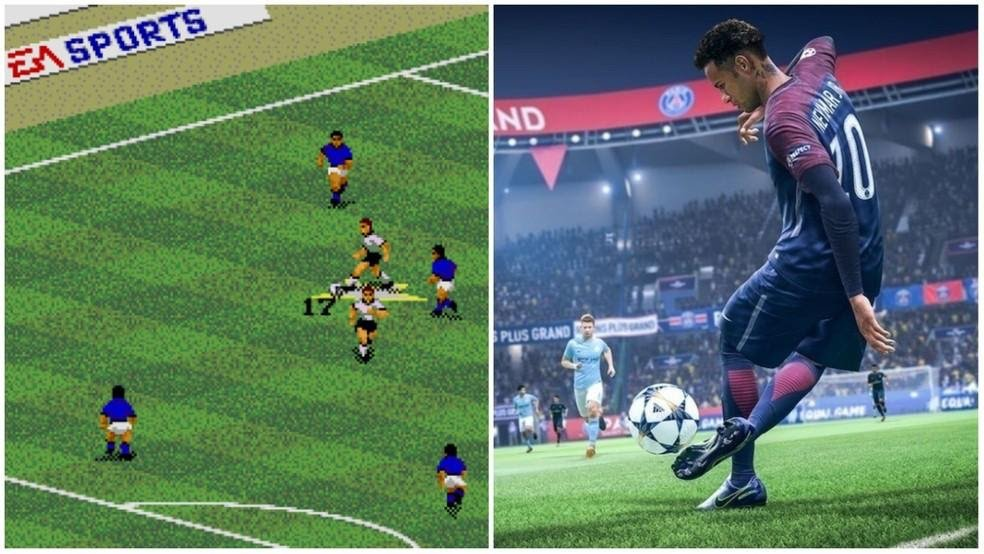
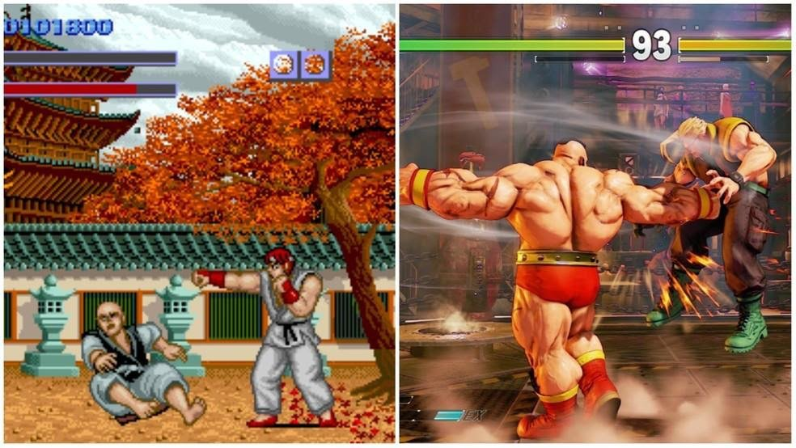
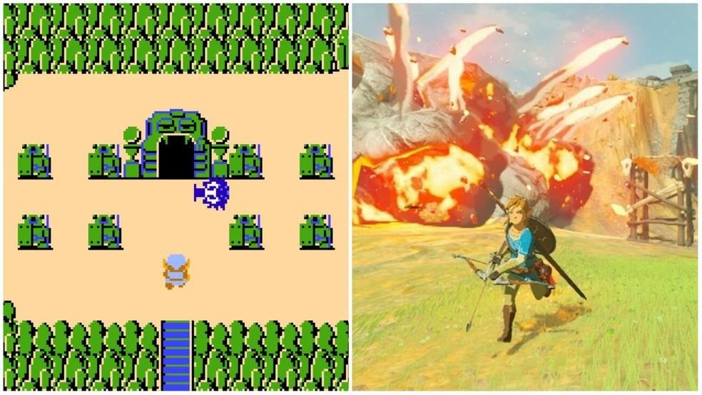
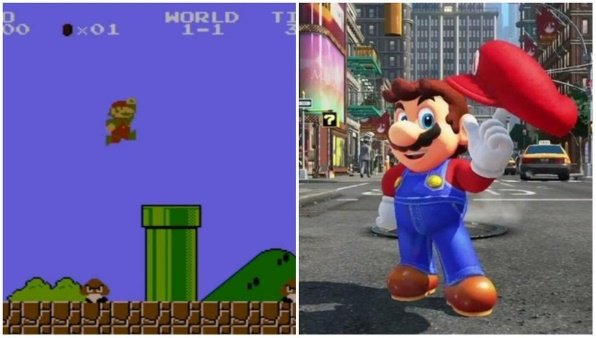

---
aliases:
  - /posts/evolucao_de_graficos_nos_games/
title: "Antes e depois: confira a evolução de gráficos de games atuais em relação ao primeiro título da mesma franquia"
date: 2022-01-25T11:54:00-03:00
author: Alunos
draft: false
tags:
  - Videogame
  - Retrogaming
  - Gaming
  - Nintendo
  - Playstation
  - Atari
  - Super Nintendo
  - Activision
  - Sega
  - GTA
  - Super Mario
  - FIFA
  - Zelda
  - The Legend of Zelda
  - Street Fighter
  - Doom
  - Mortal Kombat
  - The Sims
description: "Uma comparação da evolução gráfica de franquias clássicas dos videogames, do primeiro título até os lançamentos mais recentes."
cover: capa.jpg
---

Muitas franquias pioneiras no mundo dos jogos seguem ativas até os dias de hoje, em versões mais 
recentes, mas que ainda mantêm a sua essência. Séries como **Super Mario Bros.**, **The Legend of 
Zelda** e **Street Fighter** passaram por muitas mudanças ao longo dos anos, mantendo sua comunidade 
de fãs. Há ainda o caso de jogos como Tomb Raider ou Doom que receberam reedições bem diferentes dos 
clássicos, mas que também marcaram as gerações mais novas. Boa parte da percepção do quanto esses 
jogos evoluíram está na parte gráfica.

Veja, na lista a seguir, os gráficos de alguns jogos atuais comparados com quando eles foram lançados. 
Confira a evolução visual de grandes clássicos como **The Sims**, **Mortal Kombat** e **GTA** abaixo.
 

> 22 anos depois de seu lançamento, The Legend of Zelda teve grandes mudanças na aparência

## Tomb Raider – Shadow of the Tomb Raider

> Mesmo com o passar dos anos, Tomb Raider ainda mantém o foco na exploração

Tomb Raider, que foi originalmente lançado em 1996, é um jogo de aventura protagonizado pela 
arqueóloga britânica Lara Croft. O título fez muito sucesso com a sua mecânica de exploração inovadora 
e se tornou uma grande influência entre os games de aventura. A franquia teve o seu primeiro reboot em 
2006 após passar para as mãos da Crystal Dynamics. Depois, ela teve um novo recomeço com a Square Enix 
em uma trilogia que se encerrou com Shadow of the Tomb Raider em 2018. A personagem Lara Croft 
retornou com visual e história reformulados a cada lançamento, que também atualizavam mecânicas e 
cenários, aproveitando muito bem as tecnologias das novas gerações.

## The Sims – The Sims 4

> A simulação de vida de The Sims foi ganhando cada vez mais possibilidades com o passar do tempo

Quando foi lançado em 2000, o simulador de vida The Sims foi um sucesso absoluto. Com um estilo 
cômico, ele colocava o jogador no controle dos divertidos Sims, habitantes de uma cidade virtual que 
podiam trabalhar, casar, ter filhos e fazer diversas atividades. Depois de várias expansões, The Sims 
também recebeu algumas sequências, spin-offs e versões mobile.

O jogo mais recente da série é The Sims 4 de 2014, que possui gráficos totalmente em 3D, um número 
muito maior de atividades, mais possibilidades no modo de construção e ainda incorpora alguns recursos 
online. A sua expansão mais recente, **Vida Sustentável**, foi lançada em junho de 2020.

## Castle Wolfenstein - Wolfenstein: Youngblood

O primeiro jogo da franquia Wolfenstein marcou os primórdios dos jogos de stealth

A franquia Wolfenstein nasceu em 1981 com o jogo de ação para computadores Castle Wolfenstein. Baseado 
no filme de guerra Os Canhões de Navarone, ele teve diversas sequências, entre elas Wolfenstein 3D de 
1992, que foi muito influente para os jogos de FPS modernos. Em 2019, a franquia recebeu o game 
**Wolfenstein: Youngblood**, um shooter cooperativo com missões não-lineares e equipamentos e habil
idades para desbloquear. A franquia também já tem um jogo de realidade virtual, Wolfenstein: 
Cyberpilot.

## Doom – Doom Eternal

> A brutalidade continua sendo marca da franquia Doom

Quando Doom foi lançado, em 1993, ele se tornou um marco dos videogames. Até hoje, ele é conhecido 
como um dos mais influentes da história dos games, sendo precursor entre os jogos de tiro em primeira 
pessoa 3D. Antes com gráficos primitivos, compostos por blocos, a franquia Doom foi evoluindo ao longo 
dos anos. Em 2016, a id Software lançou um reboot da série com gráficos aprimorados e aproveitando 
recursos dos PCs e consoles modernos. O último lançamento foi Doom Eternal de 2020, sequência do 
reboot que traz um Doom Slayer com mais equipamentos e mobilidade.

## Mortal Kombat - Mortal Kombat 11

> Os famosos fatalities nasceram logo no primeiro Mortal Kombat

Mortal Kombat chegou aos arcades em 1992, chamando muita atenção por usar sprites digitalizados, com a 
imagem de atores reais. O primeiro Mortal Kombat se diferenciava por ser um jogo luta sangrento e bem 
humorado, com finalizações violentas conhecidas, como Fatalities. A série seguiu com atores nos seus 
primeiros jogos, migrando para o 3D apenas em Mortal Kombat 4. No mais recente Mortal Kombat 11, 
lançado em 2019, ainda temos muitos dos personagens e características que tornaram a franquia tão 
conhecida, agora com uma nova história e grande foco no competitivo online.

## Grand Theft Auto - GTA 5

> Os novos jogos da franquia GTA impressionam pela riqueza de detalhes

Grand Theft Auto é um jogo de ação com visão superior em que o jogador controla um criminoso que deve 
fazer trabalhos em cidades fictícias dos EUA. O primeiro título foi lançado em 1997. A jogabilidade de 
GTA acontecia em um mundo aberto, onde era possível alcançar os seus objetivos de diferentes formas. 
Já se iniciava aí o sucesso da franquia GTA, que depois ganhou vários títulos de renome como GTA: San 
Andreas e o lançamento mais recente, GTA V. Lançado em 2013, Grand Theft Auto 5 trouxe não só uma 
exploração em mundo aberto aprimorada, mas também um modo online que é muito popular até hoje.

## FIFA International Soccer - FIFA 20

> Hoje FIFA é uma das maiores franquias de jogos do mundo

A aclamada franquia de jogos de futebol **FIFA** nasceu em 1993 com o jogo FIFA International Soccer. 

Lançado inicialmente para o **Mega Drive**, ele marcou os primórdios dos jogos de simulação de clubes 
de futebol com visão isométrica, além de ter sido o primeiro jogo licenciado oficialmente pela 
Federação Internacional de Futebol. Esse foi só o início de uma das séries de games de futebol mais 
influentes de todos os tempos. Hoje a franquia FIFA é uma gigante dos games, com números altíssimos de 
vendas e vários times e jogadores licenciados.

O seu título mais recente, **FIFA 20**, já tem versões muito mais realistas dos jogadores, criadas a 
partir de um trabalhoso processo de captura de fotos. E, assim como os jogadores, os estádios também 
são reproduzidos com muitos detalhes, criando a sensação de estar comandando uma partida de futebol 
real.

## Street Fighter – Street Fighter 5

> Street Fighter foi o primeiro jogo de luta produzido pela Capcom

Street Fighter é uma das mais populares franquias de jogos de luta no mercado, mas a série passou por 
muitas transformações ao longo dos anos. A franquia nasceu como um jogo de arcade em 1987 que tinha um 
gameplay bem mais simples e acabou não ficando tão popular. O sucesso veio mesmo quando foi lançado 
Street Fighter II: The World Warrior em 1991 com vários personagens para selecionar, cada um com o seu 
próprio estilo de luta, e um gameplay aprimorado com combos e golpes especiais.

O jogo mais recente da série, **Street Fighter 5** de 2016, já tem um grande elenco de personagens, 
opções de customização, competitivo online e gráficos aprimorados para os consoles de nova geração.

## The Legend of Zelda - Breath of the Wild

> A ideia para The Legend of Zelda veio das brincadeiras de infância de Shigeru Miyamoto

m 1986 chegava ao mercado **The Legend of Zelda**, um jogo de aventura para Famicom protagonizado por 
um garoto chamado Link. Com visão superior e gráficos em 8-bit, o game foi um grande sucesso 
comercial, dando origem a uma série repleta de títulos aclamados como **The Legend of Zelda: A Link to 
the Past** do SNES, **The Legend of Zelda: Ocarina of Time** e **The Legend of Zelda: Majora's Mask** 
do Nintendo 64.

Em 2017, foi lançado para o Nintendo Wii U e Switch **The Legend of Zelda: Breath of the Wild**, um 
jogo de aventura em mundo aberto com gráficos realistas e a quebra de vários paradigmas da série. 
Breath of the Wild foi considerado por alguns críticos um dos melhores jogos de todos os tempos, e é a 
adição mais recente à franquia.

## Super Mario Bros. - Super Mario Odyssey

> Mario, protagonista dos jogos da série Super Mario Bros., ficou eternizado como o mascote da Nintendo

Apesar de não ter sido o primeiro jogo do personagem, a franquia protagonizada pelo encanador bigodudo 
surgiu em 1985 com **Super Mario Bros**. No jogo de plataforma 8-bit, os irmãos Mario e Luigi viviam 
uma aventura pelo Reino do Cogumelo para resgatar a Princesa Toadstool, que foi raptada pelo Rei 
Bowser. A série seguiu evoluindo junto com os consoles da Nintendo, com grandes jogos como **Super Mario Bros. 3** de NES, **Super Mario World** de SNES e **Super Mario 64** do Nintendo 64.

Em 2017 foi lançado para o **Nintendo Switch** o título **Super Mario Odyssey**, um game 3D estilo 
sandbox em que Mario e seu companheiro Cappy viajam por vários reinos em busca das Power Moons para 
impedir Bowser de se casar com a Princesa. Super Mario Odyssey trouxe novas mecânicas para o game, 
muitas aproveitando a habilidade de transformação do personagem Cappy.

----

Agora é sua vez, deixa nos comentarios ai embaixo se você já jogou algum desses titulos, ou já teve a 
oportunidade de comparar algum deles, aproveita e conte algum outro jogo que você jogou que não estava 
na lista mas teve muitas melhorias com o tempo
 