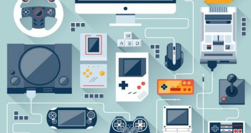
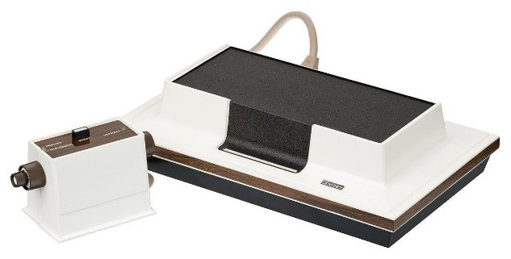
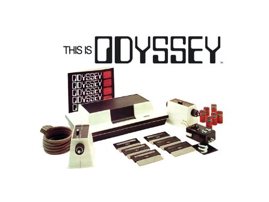
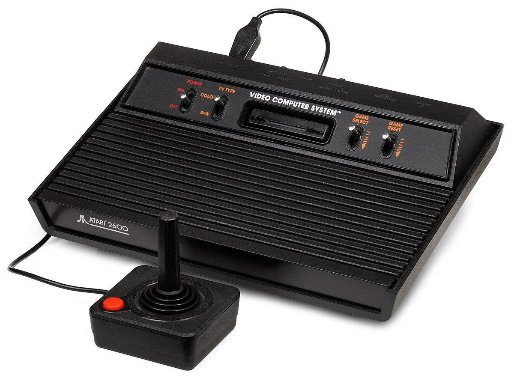
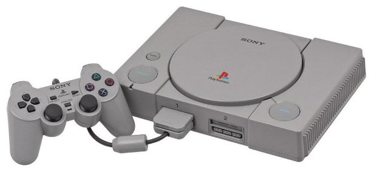

---
aliases:
  - /posts/historia_do_videogame/
title: "História do videogame: relembre os consoles que marcaram época"
author: Alunos
date: 2022-01-25T09:49:33-03:00
draft: false
tags:
  - Videogame
  - História
  - Retrogaming
  - Gaming
  - Nintendo
  - Playstation
  - Atari
  - Super Nintendo
  - Nintendinho
  - Crash Bandicoot
  - Activision
  - Sega
description: "Relembre os consoles que marcaram época, do pioneiro Magnavox Odyssey ao PlayStation 1."
cover: capa.jpg
---

> Novos videogames são lançados frequentemente, mas por trás de gráficos bonitos, há uma história extensa

*Com o tempo, as empresas foram adaptando os videogames*

Atualmente, os videogames compõem uma indústria global de US $ 100 bilhões. E não é de admirar: 
os videogames existem há décadas e abrangem uma gama de plataformas, desde fliperama a consoles 
domésticos e dispositivos móveis. Eles também estão frequentemente na vanguarda da tecnologia de 
computadores. Então, conheça a seguir a história do videogame e relembre os clássicos que 
marcaram época. Abaixo listamos alguns consoles de videogames antigos que revolucionaram e 
ajudaram a construir a história do videogame e aperfeiçoar o que hoje são os principais games no 
mundo.

## Magnavox Odyssey 

> Magnavox Odyssey foi o primeiro videogame da história
 
Em 1972 nasceu o primeiro console de videogame lançado na história, batizado de Magnavox Odyssey.
A ideia surgiu com Ralph Baer em 1966, com o intuito de criar algo que pudesse interagir com a 
TV. O primeiro protótipo foi criado em 1968 e batizado como Brown Box (Caixa Marrom). Não durou 
muito para Baer vender o projeto para a Magnavox, subsidiária da Philips. Apesar de não suportar 
qualquer tamanho de tela de televisão, ter apenas 29 jogos e não reproduzir sons, o videogame 
rendeu um relativo sucesso para a época, e vendeu 100 mil unidades. Custava cerca de 100 dólares, 
o que equivale a 550 dólares ou 2200 reais em valores atuais. Dada a simplicidade dos 
processadores disponíveis, os jogos não tinham cores e ambientes complexos. Além disso, jogador 
precisava colocar um filtro plástico, vendido com os game cards, na frente da tela da TV para dar 
a ilusão de linhas, cenários, cores e contornos durante o gameplay.

Para completar, o Odyssey era vendido com dados, fichas de poker, dinheiro de mentira e tabelas d
e pontuação. A ideia era que os jogadores encarassem o game como um tipo de jogo de tabuleiro 
digital, daí a necessidade desses acessórios curiosos.

## Atari 2600

> O Atari lançado com essa nova versão em 1977 revolucionou o mundo dos games
 
Responsável por revolucionar a história dos games, o Atari foi lançado em 1977  e carrega 
histórias curiosas por trás. Em 1970, Nollan Bushnel consertava fliperamas em Utah, cidade que 
fazia faculdade. Após pedir demissão do emprego, mostrou sua ideia a um antigo colega, Ted 
Dabney, para criar um fliperama novo. Apenas em 1972 os amigos nomearam o console de Atari, 
depois que uma construtora “roubou” o nome do antigo console Syzygy. Naquele ano foi lançado 
Pong, um dos principais jogos do fliperama. 
 
O Atari foi ganhando forma com o tempo, mas ainda não era suficiente, já que os amigos queriam 
jogar o fliperama em casa. Em 1976 o primeiro protótipo de videogame doméstico foi lançado. Com 
um videogame inovador para a época, Nollan poderia lançar qualquer jogo para consoles Atari. 
Partindo dessa ideia, Nolan e Tedy pediram ajuda de um garoto chamado Steve Jobs para montar o 
Breakout, um dos maiores sucessos da Atari.
 
O “fim do início” da Atari aconteceu em 1976 também. Steve Jobs saiu para fundar a Apple, Nollan 
Bushnell precisava de dinheiro para investir no game, então ele vendeu para a Warner. Daí em 
diante nasceu Pac-Man e Donk Kong, computadores e outras revoluções tecnológicas da segunda parte 
da Atari.

## Mega Drive

> O Mega Drive disputava vendas com o Nintendo 64

O Mega Drive da Sega chegou para criar mais uma geração de videogames com seus jogos de fitas. O console fez grande sucesso ao criar um controle com manoplas, mas principalmente por apresentar novas cores, gráficos e sons. Quem não se lembra do Sonic? O jogo idealizado pela Sega era o principal concorrente do Super Mario Bros, herói dos consoles da Nintendo nos anos 90. Na década de 90 foi grande sucesso e até hoje é possível encontrar consoles em bons estados de conservação. Assim como o Nintendo 64, o Mega Drive perdeu popularidade após a chegada da Sony com o Playstation 1.

## Playstation 1

### Playstation 1 e a nova história do videogame

> O Playstation 1 mudou a história do videogame

Então surgiu o Playstation, que então dominou a história do videogame. Tudo começou quando a Sony 
decidiu apostar nos jogos em CD, no entanto, a Nintendo achava cedo abandonar os cartuchos e 
fitas. Sem acordo, então ela se separaram. O primeiro videogame da Sony, o famoso Playstation 1 
chegou às lojas japonesas em 1994, ainda competindo com os consoles das gerações anteriores. De 
início não agradou ao público, era difícil adaptar aos novos gráficos e ao controle “moderno”. 
Contudo, duas características marcaram a história do mundo dos games pra sempre: o Memory Card e 
o Dual Stick.
 
O Memory Card era simplesmente um cartão que permitia salvar o jogo, e o usuário poderia 
continuar da onde parou. Não era algo novo, mas foi adaptado e melhorado, o que foi avaliado como 
fundamental pelos gamers da época. Já o controle Dual Stick já caiu nas graças do público, e 
certamente contribuiu para o sucesso do console, além de influenciar novas gerações de 
videogames. Além das grandes inovações, a Sony com seu Playstation 1 lançou jogos considerados 
icônicos, comoTomb Raider, Winning Elever, Resident Evil, Crash Bandicoot, entre outros.