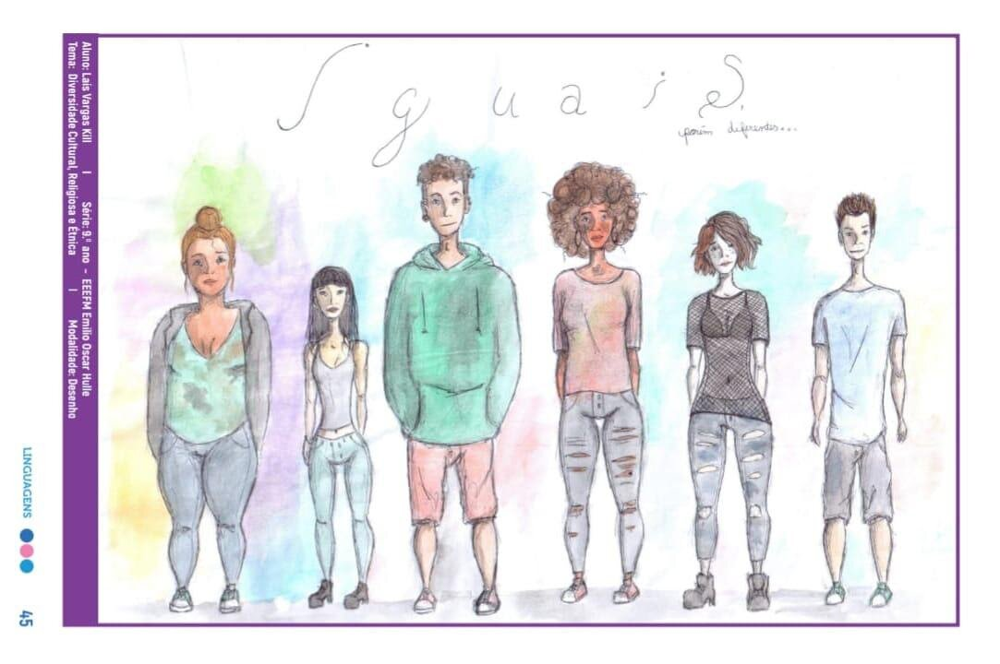
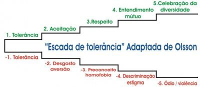

---
aliases:
  - /posts/tolerancia_e_diversade/
title: "Promover a tolerância e a diversidade, denunciar o ódio e a intolerância"
author: Alunos
date: 2021-11-28T07:48:01-03:00
draft: false
tags:
  - Sociedade
  - Bullyng
  - Respeito
description: "Um convite para promover a tolerância e a diversidade, e denunciar o ódio contra as pessoas LGBTI."
cover: capa.jpg

---

# Videos recomendados
[Faces: ONU pela diversidade LGBT e luta contra homofobia:](https://www.youtube.com/watch?v=8qsSlomXuzE)   

[Direitos Humanos:](https://www.youtube.com/watch?v=hGKAaVoDlSs)

[Rita em 5 Minutos: LGBTQIA+:](https://www.youtube.com/watch?v=EREoc40JBr8) 

[A música que todos deveriam saber a letra:](https://www.youtube.com/watch?v=H__qP2vx4Sk)

---- 
A incitação à violência contra as pessoas LGBTI é baseada em preconceitos por motivo de sua 
orientação sexual, identidade de gênero e/ou expressão, e diversidade corporal. Os discursos 
de ódio contra as pessoas LGBTI frequentemente descrevem essas pessoas como doentes, 
desviadas, propensas à delinquência, imorais, socialmente instáveis, e como uma ameaça para 
crianças e adolescentes. Estes discursos aumentam o preconceito e a intolerância, e conduzem à 
discriminação e violência.
As mensagens de ódio contra as pessoas LGBTI são mais visíveis durante os debates públicos, as 
manifestações contra a igualdade de direitos, os protestos contra as paradas do orgulho e os 
comícios. As mensagens ofensivas que buscam suprimir as referências às diversas orientações 
sexuais não normativas e às identidades de gênero, assim como uma limitação dos direitos 
humanos das pessoas LGBTI, também são difundidas através de meios de comunicação, Internet, e 
inclusive videogames e música. Como resultado disto, o progresso em direção à erradicação da 
violência e da discriminação contra as pessoas LGBTI estagnou em vários países ao redor do 
mundo, e diversas iniciativas legais e políticas discriminatórias começaram a ser 
implementadas.
Além disso, em alguns Estados, há leis que proíbem as discussões sobre orientação sexual e 
identidade de gênero, seja em espaços públicos, ambientes educacionais, ou na presença de 
crianças e adolescentes. Adicionalmente, alguns movimentos anti-direitos não somente se opõem 
ao ensino dos princípios de igualdade e não discriminação em relação a orientações sexuais e 
identidades não normativas, mas também incitam ao ódio e apelam a medidas jurídicas para 
censurar qualquer tipo de discussão sobre estes temas.
A combinação de preconceito social e, em alguns casos, o uso de leis penais destinadas a negar 
a existência de orientações sexuais não normativas, e de identidades e expressões de gênero, 
possui o efeito de marginalizar as pessoas lésbicas, gays, bissexuais, trans e de gênero 
diverso, restringindo às mesmas o exercício de seus direitos humanos, assim como lhes 
excluindo de serviços essenciais, como atenção médica, educação, emprego e moradia, dentre 
outros.
Para combater o discurso de ódio e cumprir com sua obrigação de criar um espaço propício para 
o direito à liberdade de expressão para todas as pessoas, os Estados devem promulgar leis que 
proíbam a promoção do ódio que constitua uma incitação à violência ou à discriminação por 
motivo de orientação sexual, identidade e/ou expressão de gênero, e características sexuais. 
Além disso, os Estados devem combater os discursos de ódio proferidos por funcionários 
públicos e políticos. Isto pode ser feito não somente através de medidas administrativas, mas 
também incentivando essas figuras públicas a se manifestar contra o ódio e o preconceito.
Adicionalmente, os Estados devem trabalhar ativamente para a promoção de políticas que 
garantam tanto o direito à igualdade e não discriminação, a liberdade de expressão, e o 
direito a viver uma vida livre de violência mediante a promoção da tolerância, da diversidade 
e de opiniões pluralistas, que são o centro de sociedades pluralistas e democráticas.

Para tanto, devem proteger o espaço civil e criar um ambiente seguro, onde as pessoas LGBTI 
possam expressar suas opiniões sem temor de represálias ou violência. Os Estados têm o dever 
de abordar a desinformação e os preconceitos relacionados com as pessoas LGBTI e suas 
identidades.
Os Estados devem promover pontos de vista positivos e realistas sobre as identidades LGBTI e 
suas experiências de vida. Isto pode ser feito através de campanhas públicas desenhadas para 
este fim, e incentivando particulares e interessados, como os meios de comunicação e as 
empresas, a não somente se abster de reforçar os pontos de vista estereotipados e 
preconceituosos sobre as pessoas LGBTI, mas também a participar do jornalismo que conta 
histórias que proporcionam uma visão realista de quem são as pessoas LGBTI.
Finalmente, vários órgãos de direitos humanos recomendaram a inclusão de materiais 
informativos nos currículos escolares para combater os estereótipos que exacerbam a 
discriminação contra as pessoas LGBTI. Assim sendo, a sensibilização desde uma idade precoce 
sobre a violência sofrida por estas pessoas, mediante a aplicação de uma educação baseada nos 
direitos humanos, é uma das formas em que os Estados podem intervir e abordar o estigma contra 
as pessoas LGBTI. Tanto a educação formal como a não formal podem ser utilizadas como 
ferramentas para fomentar uma cultura de respeito das diferenças, agir contra os preconceitos 
e a incitação ao ódio que se baseia na premissa da inferioridade de grupos historicamente 
discriminados, como as pessoas LGBTI, assim como promover o respeito e a dignidade de todas as 
pessoas.
Fazemos um apelo aos Estados, atores da sociedade civil e outras partes interessadas para 
promover a tolerância sobre as diversas orientações sexuais e identidades de gênero, e se 
pronunciar contra o preconceito e o ódio.
(*) Os especialistas:
Sr. Victor Madrigal-Borloz, Especialista independente sobre proteção contra a violência e 
discriminação por orientação sexual e identidade de gênero; e Sr. David Kaye, Relator Especial 
sobre a promoção e proteção do direito à liberdade de opinião e expressão.

######                Desenho de Laís Vargas Kill, publicado no Currículo do Espírito Santo, 2018

Que tal exercitar um pouco nossas reflexões? 
Como vocês podem perceber, a intolerância e falta de empatia com o próximo causam profundas 
feridas sociais que resultam em sofrimento e violência para muitas pessoas, de diferentes 
origens e culturas. Como uma forma de tentar mudar esses comportamentos destrutivos, as 
agências da ONU construíram o Marco conceitual da educação integral em sexualidade (EIS) que 
tem sete componentes fundamentais. 
Nós vamos listar os 7 marcos da tolerância a seguir, e vai competir a você escrever um 
significado para cada um deles. Construa definições e apresente esses marcos conforme a sua 
noção de mundo, levando em conta que o limite de nosso espaço de viver e pensar termina quando 
começa o espaço do outro. Exercite o respeito nessa atividade. 

1 - Gênero:  

2 - Saúde sexual e reprodutiva (SSR): 

3 - Direitos sexuais e cidadania:  

4 – Prazer: 

5 – Violência: 

6 – Diversidade: 

7 - Relacionamentos (relações): 

#### Agora que você já construiu os marcos da tolerância, apresentamos a escala de tolerância. Esse modelo foi adaptado por um estudioso, a fim de medir e estudar os posicionamentos humanos acerca do respeito à diversidade.

